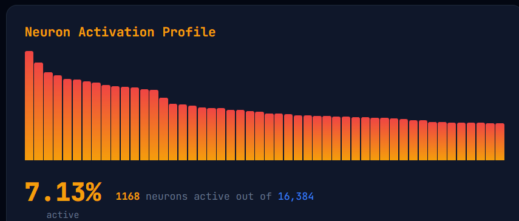
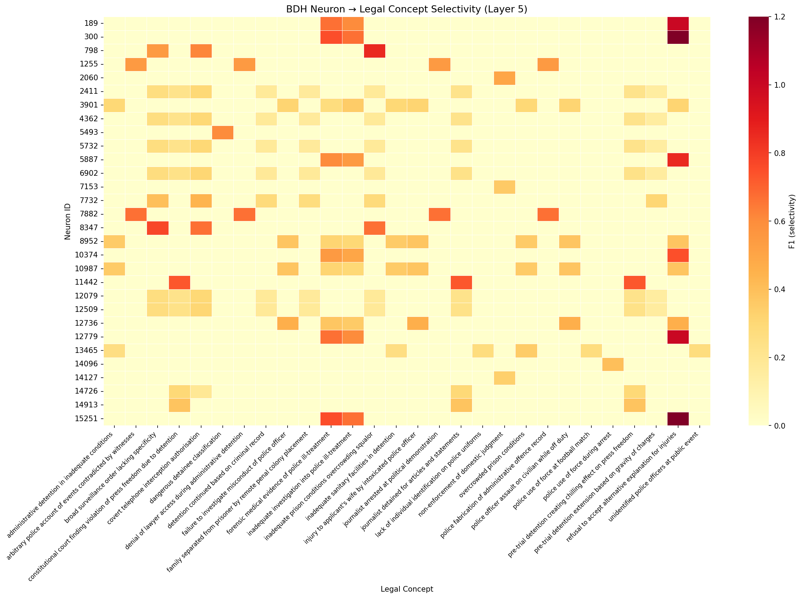
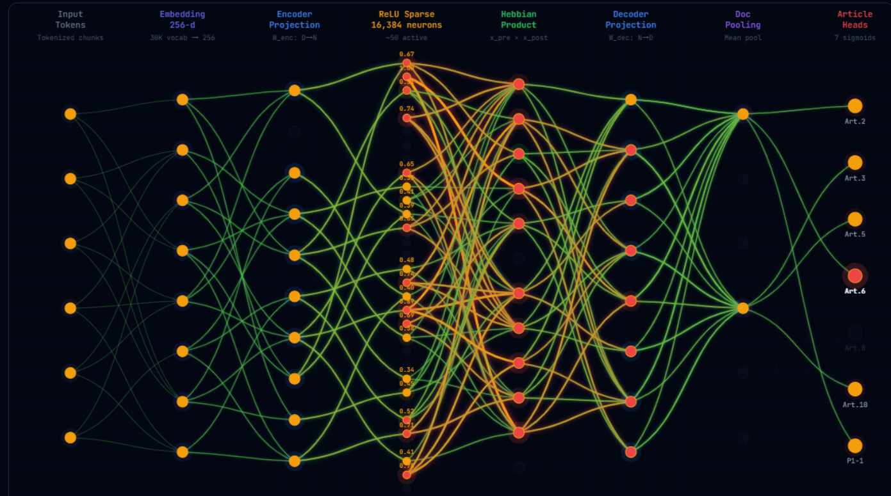
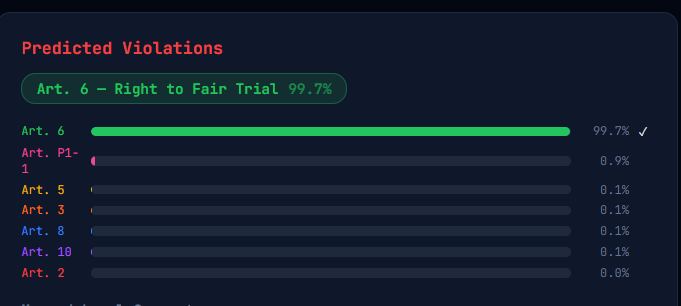

# BDH-ECHR: Post-Transformer Interpretable Legal Violation Detection

> **Kriti 2026 — High Prep | Pathway AI | Post-Transformer Frontier AI Challenge**

---

## What We Built

We built an end-to-end system that takes the full text of a European Court of Human Rights (ECHR) judgment — which can run anywhere from 5,000 to 80,000 tokens — and automatically predicts which ECHR articles have been violated (Articles 2, 3, 5, 6, 8, 10, and P1-1). Crucially, because we use the **BDH (Baby Dragon Hatchling)** architecture instead of a standard transformer, the model is not a black box: every prediction comes with a list of the specific neurons that fired, and those neurons are pre-mapped to human-readable legal concepts (e.g., *"inadequate prison conditions / overcrowding"*, *"covert telephone interception authorisation"*, *"broad surveillance order lacking specificity"*). This makes it possible to see exactly which concepts triggered a given classification — something that is structurally impossible with a standard transformer.

---

## What This Reveals About BDH

Standard transformers (BERT, GPT, etc.) distribute meaning across all neurons simultaneously, making them inherently opaque. BDH is architecturally different in ways that make interpretability a first-class property, not an afterthought.


| Property | Transformer | BDH |
|----------|-------------|-----|
| Structure | Dense matrix layers | Scale-free graph of neurons |
| Activation | Nearly all neurons fire | ~7% of neurons fire (sparse) |
| Memory | KV-cache (grows with every token) | Hebbian synapses (constant size) |
| Attention | O(T²) complexity | O(T) linear complexity |
| Interpretability | Black box | Graph structure is directly visualizable |

Our project demonstrates each of these advantages on a real legal classification task:

### 1. Sparse Activations by Design
At inference, only ~**7% of the 16,384 neurons** fire for any given document. Each neuron that fires is a signal rather than noise, so you can meaningfully ask "what does this neuron represent?"



This is dramatically sparser than a transformer, where nearly every neuron fires on every forward pass. BDH's sparsity is native to the architecture — no pruning, no masking, just ReLU gating on the Hebbian sparse dimensions.

### 2. Monosemantic Neurons
Because of the sparsity structure, BDH neurons tend to *specialise*. We found **5 monosemantic neurons** (exclusivity score ≥ 0.7) — neurons that fire almost exclusively for a single legal concept — and **213 polysemantic-but-selective neurons**, for a total of **218 interpretable neurons** out of 16,384.

| Neuron | Top Concept | Selectivity F1 | Monosemantic? |
|--------|-------------|----------------|---------------|
| N5493 | dangerous detainee classification | 0.60 | Yes |
| N798 | inadequate prison conditions / overcrowding / squalor | 0.86 | No |
| N8347 | broad surveillance order lacking specificity | 0.77 | No |
| N300 | refusal to accept alternative explanation for injuries | 1.00 | No |
| N15251 | refusal to accept alternative explanation for injuries | 1.00 | No |
| N189 | refusal to accept alternative explanation for injuries | 1.00 | No |

### 3. Hebbian Factored Product Instead of Quadratic Attention
Standard self-attention is O(n²) in sequence length. BDH replaces it with a **Hebbian product** `Δσ = x_sparse ⊙ y_sparse`, where the pre-synaptic `x_sparse` and post-synaptic `y_sparse` activations are independently ReLU-gated, and only their element-wise product is propagated. This gives:

- **Linear time** in sequence length (no O(n²) attention matrix)
- **Structured credit assignment**: exactly the pre-post pairs that co-activate are updated
- **Inspectable circuits**: you can read out which (x, y) pairs drove a decision

### 4. Shared Weights Across 6 Iterations (Deep Reasoning, Low Parameters)
A single set of parameters is applied 6 times in a recurrent-style loop. This gives the model deep representational capacity while keeping the parameter count low:

```
BDH parameters:   20.5M
BERT-base:        110M     (5.4× more)
Our BERT baseline: 22.7M   (comparable size, far worse results — see below)
```

### 5. Long-Context Hierarchical Processing
BERT is hard-capped at 512 tokens. BDH processes up to 8 × 512-token overlapping chunks and pools their representations, giving an effective context of **3,584 tokens** — enough to cover the majority of ECHR judgments without truncating critical evidence paragraphs.

```
Document token statistics (ECHR dataset):
  Mean:    1,776 tokens
  Median:  1,142 tokens
  P95:     4,937 tokens
  Max:    22,637 tokens
```

---

## Performance Results

### BDH vs BERT Baseline (Test Set, 822 cases)

| Metric | BDH (ours) | BERT baseline | Improvement |
|--------|-----------|---------------|-------------|
| Micro-F1 | **0.7716** | 0.5685 | +20.3pp |
| Macro-F1 | **0.7675** | 0.4614 | +30.6pp |
| Sample-F1 | **0.7783** | — | — |
| Precision | **0.7643** | — | — |
| Recall | **0.7791** | — | — |
| Parameters | **20.5M** | 22.7M | 10% fewer |

The BERT baseline was trained from scratch (hidden=384, layers=6, heads=12, ~22.7M params) on the same dataset and splits. BDH outperforms it by **+20pp Micro-F1** and **+30pp Macro-F1** with a comparable parameter budget, while also being interpretable.

### Per-Article Test F1 (BDH)

| Article | Description | Test F1 |
|---------|-------------|---------|
| Art. 2 | Right to Life | **0.8850** |
| Art. 3 | Prohibition of Torture | 0.8359 |
| Art. P1-1 | Protection of Property | 0.7787 |
| Art. 6 | Right to Fair Trial | 0.7709 |
| Art. 5 | Right to Liberty | 0.7645 |
| Art. 8 | Right to Private Life | 0.6894 |
| Art. 10 | Freedom of Expression | 0.6479 |

Article 10 has the lowest F1 because it is the rarest class (3.2% of training labels). This was partially mitigated with pos_weight and per-label threshold tuning.

### Dataset Label Distribution

| Split | Cases | Art. 2 | Art. 3 | Art. 5 | Art. 6 | Art. 8 | Art. 10 | Art. P1-1 |
|-------|-------|--------|--------|--------|--------|--------|---------|-----------|
| Train | 7,968 | 3.2% | 15.0% | 15.2% | 52.3% | 7.9% | 3.2% | 15.8% |
| Val | 813 | — | — | — | 51.4% | — | — | — |
| Test | 822 | — | — | — | 50.1% | — | — | — |

---

## Interpretability in Action

### Neuron → Concept Heatmap

The image below shows the selectivity F1 scores for the top neurons and the legal concepts they are mapped to. Brighter cells indicate stronger and more exclusive association between a neuron and a concept.



### How Concept Mapping Works

1. **Capture**: Run 200 test cases through BDH with instrumented hooks on the last sparse layer (layer 5). Record the IDs and magnitudes of every neuron that fires.
2. **Label concepts**: Use the silver paragraph-level rationales in the ECHR dataset. The rationale texts are exported to a prompt file, fed to Claude, and the response (concept labels) is saved as a plain text file and ingested back.
3. **Co-activate**: For each (neuron, concept) pair, count how many times they appear in the same document.
4. **Score selectivity**: Compute precision (P(neuron fires | concept present)), recall (P(concept present | neuron fires)), and F1 = harmonic mean.
5. **Identify monosemantic neurons**: Exclusivity = precision / Σ(precision over all concepts). Neurons with exclusivity ≥ 0.7 are flagged as functionally monosemantic.

**Total concepts extracted**: **477 unique legal concepts** across 200 cases.
**Interpretable neurons**: **218** (1.3% of 16,384).

### Example: What the Model Tells You for a Real Case

```
Input: [ECHR judgment text, ~2,400 tokens]

Predicted violations:
  Article 3  — Prohibition of Torture  (prob: 0.91)
  Article 5  — Right to Liberty        (prob: 0.73)

Top active neurons: [5493, 798, 300, 189, ...]

Mapped concepts:
  1. "inadequate prison conditions / overcrowding"    (neurons: 798)
  2. "dangerous detainee classification"              (neurons: 5493)
  3. "refusal to accept alternative explanation"      (neurons: 300, 189)
```

---

## Architecture Overview

```
Input document (up to ~80k tokens)
        |
   Hierarchical chunking (8 × 512-token chunks, 64-token overlap)
        |
   [For each chunk]
        |
   BERT tokenizer (bert-base-uncased, vocab 30,522)
        |
   Embedding layer  (30,522 → 256-dim)
        |
   ┌─────────────────────────────────────┐
   │  BDH Core  ×6 iterations (shared)   │
   │                                     │
   │  Encoder: (256-dim → 4,096-dim)     │
   │  RoPE rotary position encoding      │
   │  Bidirectional linear attention     │
   │  x_sparse = ReLU(Wx)                │
   │  y_sparse = ReLU(Wy)                │
   │  Hebbian product: x_sparse ⊙ y_sparse│
   │  Decoder: (4,096-dim → 256-dim)     │
   └─────────────────────────────────────┘
        |
   Token pooling (mean over chunk tokens)
        |
   Chunk pooling (mean over 8 chunks)
        |
   Classification head (256 → 7 articles)
        |
   Per-label threshold tuning (validation set)
        |
   Predicted violations + sparse neuron activations
```

**Key numbers:**
- 6 BDH iterations (layers), all sharing the same weights
- 4 heads × 4,096 sparse dimensions = **16,384 total neurons**
- Total parameters: **20.5M**

The dashboard renders this architecture live for every case you analyze — nodes light up amber/red as neurons activate, with edge weights reflecting signal strength:



---

## Download the Trained Model

> **[Download `best_model (1).pt` — [(https://drive.google.com/file/d/1BQpp5ojmteV56gIZwtcOGk1v27eSnqzY/view?usp=sharing)]**

Place the downloaded file in the project root as `best_model (1).pt`. The server will load it automatically.

---

## How to Run Locally

### Prerequisites

- Python 3.9–3.11
- NVIDIA GPU recommended for training; CPU is sufficient for inference

### 1. Clone the repository

```bash
git clone https://github.com/your-username/LegalClassifier.git
cd LegalClassifier
```

### 2. Create a virtual environment

```bash
python -m venv .venv

# Windows PowerShell
.\.venv\Scripts\Activate.ps1

# Linux / macOS
source .venv/bin/activate
```

### 3. Install dependencies

```bash
# GPU (CUDA 12.1)
pip install torch torchvision torchaudio --index-url https://download.pytorch.org/whl/cu121

# CPU only
pip install torch torchvision torchaudio

pip install transformers fastapi uvicorn numpy pandas scikit-learn tqdm jupyter matplotlib seaborn
```

### 4. Download the trained checkpoint

Download `best_model.pt` from the link above and place it in the project root.

### 5. Start the server

```bash
uvicorn src.server.app:app --host 0.0.0.0 --port 7860
```

The server starts on **`http://localhost:7860`**.

Open that URL in your browser — the full dashboard loads automatically.

### 6. Run the training notebook (optional — to retrain)

```bash
jupyter notebook
# Open: notebooks/01_train_bdh.ipynb
# Run all cells
```

Requires Kaggle credentials set as environment variables `KAGGLE_USERNAME` and `KAGGLE_API_KEY` for the `mathurinache/ecthrnaacl2021` dataset, or download it manually.

### 7. Regenerate interpretability data (optional)

```bash
jupyter notebook
# Open: notebooks/02_interpretability.ipynb
# Set MODE = "capture" → extracts activations from 200 test cases
# Set MODE = "dump"    → writes data/prompts_for_claude.txt
# Feed that file to Claude, save Claude's response as data/concepts_from_claude.txt
# Set MODE = "ingest"  → builds data/coactivation_raw.json, data/concept_occurrence.json
```

---

## Hosted Demo

> **[(https://huggingface.co/spaces/DebarghyaD/LegalClassifier)]**

---

## Dashboard Walkthrough

The interactive dashboard has 5 tabs:

| Tab | What It Shows |
|-----|---------------|
| **Analyze Case** | Paste any ECHR judgment text → see predicted violations, top active neurons, sparsity gauge, mapped legal concepts |
| **Network Graph** | Animated force-directed graph of the neural network — nodes light up showing which neurons fired for your case |
| **Explore Examples** | 15 pre-loaded real test cases with true labels, predicted labels, and concept explanations |
| **Concept Index** | Bubble chart of all 477 legal concepts; click any concept to see which neurons encode it |
| **Architecture** | Visual diagram of the BDH architecture with model metadata |

---

## Repository Structure

```
LegalClassifier/
├── src/
│   ├── model/
│   │   ├── architecture.py         # BDH model classes (BDHConfig, BDHBackbone, BDHClassifier)
│   │   └── __init__.py
│   ├── inference/
│   │   ├── activations.py          # Sparse activation extraction utilities
│   │   ├── chunking.py             # Hierarchical text chunking
│   │   ├── concepts.py             # ConceptMapper — neuron → concept mapping
│   │   ├── data.py                 # Data loading and silver rationale parsing
│   │   └── __init__.py
│   └── server/
│       ├── app.py                  # FastAPI server (port 7860)
│       └── __init__.py
│
├── notebooks/
│   ├── 01_train_bdh.ipynb          # BDH training (Kaggle dual-T4)
│   ├── 02_interpretability.ipynb   # Neuron-concept mapping pipeline
│   └── 03_bert_baseline.ipynb      # BERT from-scratch baseline
│
├── web/
│   ├── index.html                  # Dashboard entry point
│   └── bdh-dashboard.jsx           # React + D3.js frontend
│
├── data/
│   ├── coactivation_raw.json       # Neuron x concept co-activation counts
│   ├── concept_occurrence.json     # Concept frequency across corpus
│   ├── example_records.json        # 200 test cases with activations
│   └── concepts_from_claude.txt    # LLM-extracted legal concept labels
│
├── assets/
│   ├── neuron_concept_heatmap.png  # Neuron x concept selectivity heatmap
│   ├── neuronactivation.png        # Activation sparsity profile screenshot
│   ├── NetworkGraph.png            # Live network graph screenshot
│   └── Predictions.png             # Dashboard predictions panel screenshot
│
├── best_model (1).pt               # Trained BDH checkpoint (~245 MB)
├── requirements.txt
└── README.md
```

---
## TEAM MEMBERS  AND CONTRIBUTIONS : 

- ABHI TANWAR - Understanding the model architecture and ideation of the way forward, planning.
- ARNAV GUPTA - Sparsity exploration and implementation showing neurons fired.
- NALIN GOEL - Hebbian learning demonstration, and long context handling.
- KARAN ADITYA - Interpretability demonstration and sparsity exploration.
- DEBARGHYA DAS - Prototype web development and ideation
- PRIYANSHU DEBNATH - Ideation and development.
- ATRIJO PAL - Ideation and development.
- DHAIRYA NISAR - Ideation and development.
---

## Limitations

- **Dataset size**: Training on ~8,000 cases. Larger legal corpora would likely improve rare-article performance (Art. 10 F1 = 0.65).
- **Context ceiling**: Effective context is 3,584 tokens. Very long judgments (max 22,637 tokens in dataset) are still truncated at the chunk level.
- **Concept extraction quality**: Legal concept labels are generated by an LLM (Gemini 2.0 Flash) from silver rationales. LLM errors propagate into the concept index.
- **Interpretable neurons**: Only 218 of 16,384 neurons (1.3%) are currently mapped to concepts. This is a direct consequence of the sample size used for concept extraction — we ran instrumented inference on 200 test cases. With only 200 documents, many neurons simply never fired enough times to co-activate with the same concept repeatedly, so they cannot be reliably assigned a concept. Running the pipeline over thousands of cases would increase both the number of mapped neurons and the confidence of existing mappings.
- **Monosemantic vs polysemantic**: We found only 5 monosemantic neurons (exclusivity ≥ 0.7) against 213 polysemantic ones — not because BDH is polysemantic by nature, but because 200 samples is too small a probe set. Monosemanticity is measured using co-activation counts: a neuron that fires for 5 different legal concepts across 200 cases will look polysemantic even if it is truly selective, because the 200 cases happen to overlap across those concepts. With more samples and more granular concept labels, the true share of monosemantic neurons would almost certainly be higher. The architecture's sparsity is specifically designed to push neurons toward single-concept encoding.
- **Language**: English only (ECHR judgments are in English/French; dataset uses English versions).
- **Inference speed**: CPU inference is slow for long documents due to chunking. GPU recommended.

---

## Future Scope

- **Scale the concept mapping pipeline** to all 16,384 neurons using automated LLM pipelines
- **Per-layer circuit tracing** to see how a concept evolves across the 6 BDH iterations
- **Causal intervention experiments**: zero out specific neurons and observe change in predictions to confirm causal role
- **Multi-language support**: extend to French ECHR judgments using multilingual tokenizer
- **Larger training set**: include case_id metadata, cross-reference related cases
- **User-facing explanations**: generate natural-language explanations from neuron activation patterns (e.g., "This case was flagged for Article 3 because neurons associated with 'inadequate detention conditions' activated strongly")
- **Compare against LegalBERT and other legal-domain models**
- **Deploy on Hugging Face Spaces** for persistent public access


## Video Demo and Screenshots

> **[Add video demo link here]**

### Predicted Violations — Article 6 flagged at 99.7% confidence



### Neuron Activation Profile — 7.13% sparsity (1,168 of 16,384 neurons active)


### Network Graph — Live Signal Flow Through BDH's 8 Stages

Input Tokens → Embedding → Encoder Projection → **ReLU Sparse (16,384 neurons)** → Hebbian Product → Decoder Projection → Doc Pooling → Article Heads. Amber nodes are inactive; red/orange nodes are firing. Art. 6 output node is highlighted for this case.


### Neuron-Concept Selectivity Heatmap

Each cell shows how strongly a neuron (row) is associated with a legal concept (column). Brighter = more selective. Neurons that appear bright in only one column are functionally monosemantic.


---

## Key References

- BDH architecture: Pathway AI Research, *"Dragon Hatchling: A Post-Transformer Architecture with Hebbian Memory, Sparse Activations, and Linear-Time Attention"*
- Dataset: Chalkidis et al. (2021), *"Paragraph-level Rationale Extraction through Regularization"*, NAACL 2021 — `mathurinache/ecthrnaacl2021` on Kaggle
- Monosemanticity: Elhage et al. (2022), *"Toy Models of Superposition"*, Anthropic
- Sparse autoencoders and interpretability: Bricken et al. (2023), *"Towards Monosemanticity"*, Anthropic
